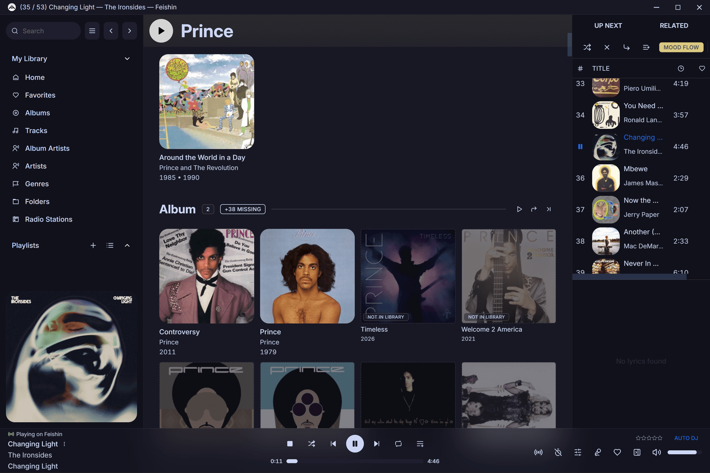
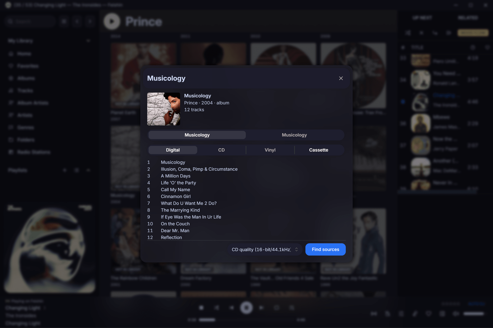
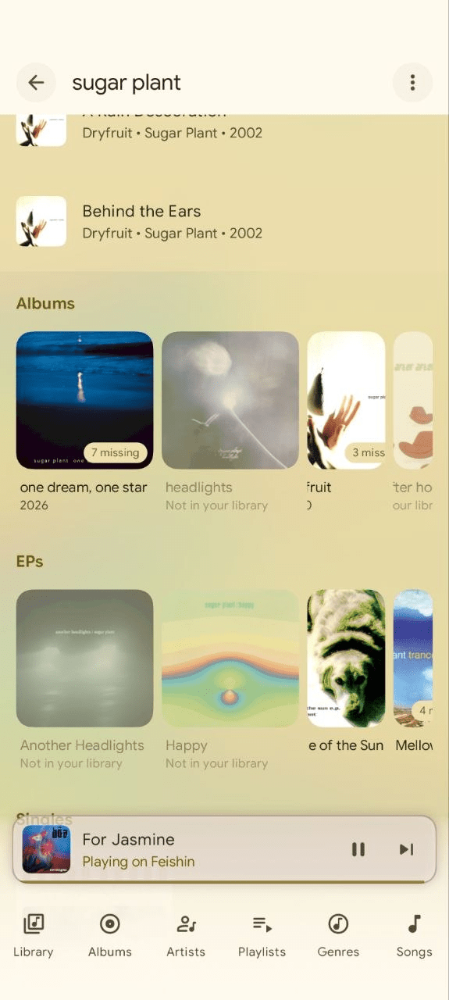
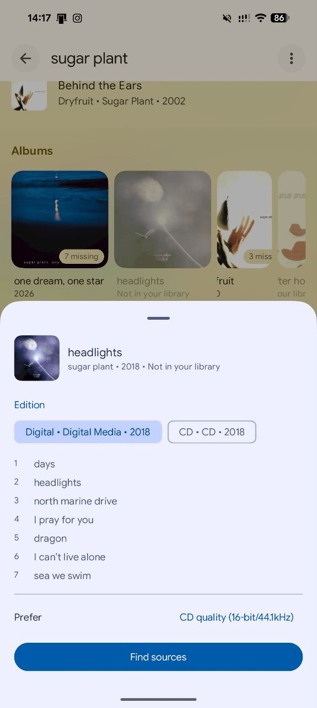
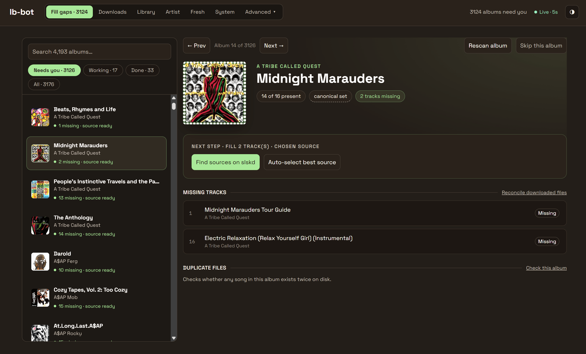

# navi-connect

**Your music library, finished and shared.** navi-connect joins two self-hosted projects into one:
a Spotify-Connect–style **shared playback session** across every device, and **lb-bot**, which knows
every album your library is missing and can fetch it — from inside the player, on the artist page
you're already looking at.

### ▶ [**Setup & testing guide →**](TESTING-SETUP.md)

**If you want to run this, start there, not here.** It covers prerequisites, step-by-step setup, a
smoke test that isolates failures, and every known bug and caveat. Prebuilt clients are on the
[Releases](../../releases) page — no toolchain required.

This file explains *what the project is and how it fits together*. `PROTOCOL.md` has the wire spec.

### Repositories

| Repo | What's in it |
|---|---|
| **[navi-connect](https://github.com/illuminator69/navi-connect)** (you are here) | The hub, the **Navic** Android client, the docs, and the [prebuilt releases](../../releases). |
| **[feishin](https://github.com/illuminator69/feishin)** | The desktop client. Kept separate so upstream Feishin releases can still be merged with `git merge upstream/<tag>` — flattening ~4,700 commits of upstream history into this tree would destroy that. GPL-3.0; this is also where the binaries' source lives. |
| **[lb-bot](https://github.com/illuminator69/lb-bot)** | The library-gap filler. An independent service with its own release cycle, useful on its own, and optional here. |

---

## What you get

### The missing half of your library, visible

Open an artist and the albums you *don't* have sit right there among the ones you do — greyed out and
marked, a partly-owned album carrying its missing count. Nothing is a separate "wanted" list; the gaps
live where you'd notice them.



**A download is reviewed, not fired blind.** Pick the edition, check it against the canonical
MusicBrainz tracklist, choose a quality, and only then go looking for sources.



The same surface on Android — note the mini-player reading **Playing on Feishin**: the phone is
controlling a session running on the desktop.

| Artist page | Album review |
|---|---|
|  |  |

Behind it, lb-bot's own workspace handles the per-track gap filling — which tracks are absent, which
sources are ready, and what it's working on.



### Everything else

- **One playback session, every device.** Control what's playing on one device from another; move
  playback mid-song to your desktop, your phone, or a Chromecast, and it resumes on the same beat.
- **Recommendations that follow you.** AudioMuse-AI similar-songs radio, artist radio, Song Journey,
  text→mood search, and an adaptive "Mood Flow" that reacts to what you skip — playing on whichever
  device is currently active.
- **Continue Listening across clients.** A shared, hub-owned queue history, so what you started on
  your phone is waiting on your desktop.

Both halves are optional and fail soft: no lb-bot means the discography surface simply isn't there,
no AudioMuse means those features grey out. The core remote-control layer needs neither.

---

## Contents

  - [Repositories](#repositories)
- [What you get](#what-you-get)
  - [The missing half of your library, visible](#the-missing-half-of-your-library-visible)
  - [Everything else](#everything-else)
- [1. What it is / the problem it solves](#1-what-it-is--the-problem-it-solves)
- [2. Components](#2-components)
- [3. Architecture](#3-architecture)
  - [Roles](#roles)
  - [Transfer-with-resume](#transfer-with-resume)
  - [Chromecast](#chromecast)
  - [Data/theming philosophy](#datatheming-philosophy)
- [4. The wire protocol (summary)](#4-the-wire-protocol-summary)
- [5. External APIs used](#5-external-apis-used)
  - [Navidrome — Subsonic / OpenSubsonic](#navidrome--subsonic--opensubsonic)
  - [AudioMuse-AI — two tiers](#audiomuse-ai--two-tiers)
  - [lb-bot — library-gap intelligence](#lb-bot--library-gap-intelligence)
- [6. Features (current)](#6-features-current)
  - [Core remote-control (confirmed working)](#core-remote-control-confirmed-working)
  - [Library & playback features](#library--playback-features)
  - [AudioMuse recommendation layer](#audiomuse-recommendation-layer)
  - [Known open items (see TESTING-SETUP.md §8)](#known-open-items-see-testing-setupmd-8)
- [7. Where the code lives (integration points)](#7-where-the-code-lives-integration-points)
  - [Hub — hub/hub.py](#hub--hubhubpy)
  - [Feishin (renderer unless noted)](#feishin-renderer-unless-noted)
  - [Navic (commonMain unless noted)](#navic-commonmain-unless-noted)
- [8. Build & run](#8-build--run)
  - [Hub](#hub)
  - [Feishin (Electron / Windows)](#feishin-electron--windows)
  - [Navic (Android / KMP)](#navic-android--kmp)
- [9. Conventions & gotchas](#9-conventions--gotchas)
- [10. Directory map](#10-directory-map)

---

## 1. What it is / the problem it solves

Navidrome is a self-hosted music server (Subsonic-compatible). Its clients normally each play
independently. navi-connect adds a **shared playback session** across devices — like Spotify
Connect — so you can:

- Control what's playing on one device from another (play/pause/next/seek/volume/queue edits).
- **Transfer playback with resume** between devices (same track, same position) — phone → desktop → TV.
- **Cast to a Chromecast** and have it appear as a device in every client's picker.
- Get **recommendations / autoplay / adaptive radio** (AudioMuse-AI) that play on whichever device is active.

It is a **single-user, personal** setup (one Navidrome account). Everything runs on the user's own
infrastructure (Unraid, Docker `media` network). Server: `https://music.example.com` (publicly reachable —
important for Chromecast, which must fetch stream URLs directly).

---

## 2. Components

| Component | What it is | Tech | Location |
|---|---|---|---|
| **Hub** | Headless relay holding session intent; routes commands; AudioMuse Tier-2 + lb-bot proxies; optional Navidrome `savePlayQueue` mirror | Python 3.11+, asyncio, `websockets`, **port 4790** | `hub/` |
| **Feishin** (fork) | Desktop client (controller + receiver) + the **Chromecast bridge** | Electron / TypeScript / React, Windows | `feishin/` |
| **Navic** (fork) | Mobile client (controller + receiver) + native Chromecast | Kotlin Multiplatform / Compose, **Android only** | `navic/` |
| **Navidrome** | The music server (not in this repo) | Go, Subsonic/OpenSubsonic API | `https://music.example.com` |
| **AudioMuse-AI** | Recommendation engine (not in this repo) | Navidrome plugin (Tier 1) + core HTTP API (Tier 2) | server-side |
| **lb-bot** | Library-gap filler (missing-album discography + Soulseek acquisition). Separate repo, reached **through the hub** on `/lb/*` | Python/Flask, port 8899 | [own repo](https://github.com/illuminator69/lb-bot) |

**Scope boundaries:** iOS is out of scope (Navic's commonMain must still *compile* for iOS, but no
iOS features/testing). The web build of Feishin falls back gracefully (Tier-2 AudioMuse is desktop-only
because it needs the Electron main process to bypass CORS).

---

## 3. Architecture

### Roles
- The **hub** owns *session intent*: `queue, index, positionMs, isPlaying, activeDevice, repeat,
  shuffle, order`. It persists across restarts (but clears `activeDevice` and sets `isPlaying=false`
  on load). It never touches audio.
- Every client is **both a controller and a receiver**. It connects over WebSocket, sends a `hello`
  (persisted device id + token), receives a `welcome` (session snapshot + device list).
- The **active receiver** is the source of truth for live position and sends `report` frames ~1 Hz.
- **Controllers** send `act` frames; the hub applies intent and forwards `do` directives to the active
  receiver.

### Transfer-with-resume
Hub sends `do:release` to the old device → it replies `released` with its final index+position → hub
sends `do:load {tracks, index, positionMs, play}` to the target. Resume is exact.

### Chromecast
Bridged by **either client**, whichever sees the speaker first — Feishin's main process
(`bonjour-service` + `castv2-client`) or Navic (`NsdManager` + a hand-rolled castv2 client). Neither
uses a Cast SDK. Every mDNS-discovered cast device is registered with the hub as a virtual `receiver`
(id `cast-<id>`, name `📺 <name>`), so it appears in every client's device picker and casting is just
a transfer. Audio = direct Navidrome stream URLs (must be publicly reachable — set Feishin's
"Public server URL" to `https://music.example.com`, not a Tailscale/LAN address).

Only one client bridges a given speaker: a client that sees `cast-<id>` already online stands down,
and one superseded off the id (hub close `4003`) stays down for 5 minutes rather than kicking back.
See PROTOCOL.md §12.2.

**Scrobbling a cast session** is the bridging client's job (Feishin: `use-cast-scrobble.ts`, gated
on `cast.bridgedDevices()`; Navic: `CastScrobbler`, gated on a `BRIDGING` speaker — both keyed on
the active device).
A Chromecast holds no Navidrome credentials, so the receiver-reports-its-own-plays
rule leaves nobody to report; the single-bridge rule above is what stops two
watching controllers both counting the play.

### Data/theming philosophy
Both clients derive dynamic UI color from album art (kmpalette → materialKolor scheme in Navic).
AudioMuse "Mood Flow" drives an adaptive visualizer.

---

## 4. The wire protocol (summary)

Full spec in `PROTOCOL.md`. Frames are plain JSON with a `t` discriminator. (The same port also
answers plain HTTP on `/sonic/*` and `/lb/*` — the AudioMuse Tier-2 and lb-bot proxies, §5 — which
are not part of this catalog.)

| Frame | Direction | Purpose |
|---|---|---|
| `hello` | client → hub | announce device (id, token, name, platform, caps) |
| `welcome` | hub → client | session snapshot + device list |
| `act` | controller → hub | intent: `play/pause/playpause/next/previous/jump/seek/setQueue/enqueue/volume/repeat/shuffle/transfer/move/remove/clear` + saved-queue mgmt `renameSavedQueue/deleteSavedQueue/deleteSavedQueues/syncSavedQueues` |
| `do` | hub → active receiver | directive: `load/play/pause/jump/seek/setVolume/setRepeat/setShuffle/release/queueChanged` |
| `report` | active receiver → hub | ~1 Hz position/index/isPlaying |
| `released` | receiver → hub | final index+position on release (transfer handshake) |
| `session` | hub → clients | broadcast session state changes (incl. `savedQueueId` of the current queue) |
| `progress` | hub → clients | ~1 Hz position for remote controllers to interpolate |
| `devices` | hub → clients | device list changes |
| `savedQueues` | hub → clients | shared saved-queue history changed (also embedded in `welcome`) |
| `error` | hub → client | error |

**Hub safeguards:**
- `INTENT_GRACE = 2.0s`: after a user play/pause `act`, contradicting `isPlaying` reports are ignored
  (guards against a stale 1 Hz report from *another* device's socket flipping state back).
- On active-device disconnect: `isPlaying=false`, queue/position kept, **active id cleared** — "no live
  receiver" is the signal every still-open client uses to adopt the last-known queue locally (paused).
  A device that was really still playing re-claims active via its reporter on reconnect.
- **Taking over an orphaned session** (`act:play` with no active device) is answered with a full
  `do:load` carrying the session's queue + position, not a bare `do:play` — the new device knows
  nothing of the session, so it must be told where the dead one left off.
- Transferring to the **already-active** device is a no-op (a reload there would rewind by up to one
  report interval).

**Track metadata** carried in the queue includes `streamUrl` + `mime` (for the cast bridge),
`imageUrl`, `durationMs`, and per-track `userFavorite`/`userRating`.

**Saved-queue history is hub-owned** (Continue Listening): the hub keeps a rolling, capped list of
queue records, broadcasts it (`savedQueues`), and marks the current one via `session.savedQueueId`. A
`setQueue` records/refreshes it and a top-up grows the *same* record; both clients render one shared
history with the active queue highlighted. Each client keeps a local store as an **offline cache** and
`syncSavedQueues` reconciles on reconnect — a field-level union-merge (newest-wins, but a copy that
lacks a name never blanks one), with **tombstoned deletions** so a client's stale row can't resurrect
a deleted queue. Tombstones are kept on both sides: a client replays the deletions it made while
offline (`syncSavedQueues.deleted`), and a tombstoned id is inert on the hub — neither a re-sync nor
a `setQueue` from a device that kept playing can bring the record back. A record's **identity is a listening session, not a track list**: name, kind and
cover are stamped once at birth, and edits (reorder/remove/play-next/top-up/shuffle) refresh the
*same* record — only a genuine new play mints another. See `PROTOCOL.md` §8.3.

---

## 5. External APIs used

### Navidrome — Subsonic / OpenSubsonic
Standard Subsonic auth (salted token). Used for library, streaming, playback, ratings, playlists:
- `stream` (with `maxBitRate` + `format` for transcoding), `getSongDetail`, `getAlbumList2`
  (`frequent`/`newest`/`recent` for home rows), `getArtists`, `search3`, `star`/`unstar`, `setRating`,
  `savePlayQueue` (hub mirror), `getСoverArt`.
- **Native Navidrome API** (`POST /auth/login` → Bearer, `POST /api/playlist` with `rules` criteria
  JSON) for **smart playlists** (Navic `NativeApiManager`).

### AudioMuse-AI — two tiers
**Tier 1 — Navidrome plugin, zero config, Subsonic auth** (works today on 0.62.0; sonic endpoints
require the AudioMuse plugin loaded — probe with `getOpenSubsonicExtensions` advertising
`sonicSimilarity`):
- `getSimilarSongs2(id, count)` → Instant Mix / Similar autoplay (works vanilla).
- `getArtistInfo` → Artist Radio.
- `getSonicSimilarTracks(id, count)` → scored similar; `findSonicPath(startSongId, endSongId, count)`
  → **Song Journey**.

**Tier 2 — AudioMuse core HTTP API** (synchronous in-memory lookups, so fast; only ML jobs are queued
off the client path). **Reached through the hub**, not directly: `<hub>/sonic/*` with the hub token
(plain HTTP on the WebSocket port — `PROTOCOL.md` §14). The hub holds
the AudioMuse address, its API token and the Navidrome password server-side, so no device carries
them and the core API needs no internet exposure; it whitelists the five routes below, injects the
credentials, caps concurrency and caches results for both clients. Each client keeps its old direct
`http://host:8000` + `Bearer <API_TOKEN>` config as an explicit fallback for a LAN setup with no hub,
and demotes itself to it for 10 minutes if the hub reports no AudioMuse configured. Still desktop-only
in Feishin (routed through the Electron main process to avoid CORS); native Ktor in Navic:
- `GET /api/sonic_fingerprint/generate?n=` → autoplay seeded from listening habits.
- `POST /api/alchemy {items:[{op:ADD|SUBTRACT,id,type}], n, temperature?, subtract_distance?}` →
  centroid + nearest songs (returns `centroid_2d`). This is the engine behind **Adaptive "Mood Flow"**.
- `POST /api/clap/search` → text→mood search. (`chatPlaylist` intentionally **not** used — no LLM on
  the server.)

All AudioMuse calls are **fail-soft**: a cold index, missing plugin or unreachable hub greys the
feature out and falls back to Tier 1, never errors.

### lb-bot — library-gap intelligence
A separate self-hosted service (its own repository) that indexes each artist's full
MusicBrainz discography, knows which releases the library lacks, and can acquire one from Soulseek
and place it. Reached **only through the hub** (`<hub>/lb/*`, `PROTOCOL.md` §15,
its own Flask API has no authentication and binds
`0.0.0.0:8899`, so unlike AudioMuse there is deliberately **no direct-LAN fallback**. `LBBOT_URL`
unset = the whole surface hides. Whitelisted routes cover the instant discography read, the
explicit "index this artist" scan, album editions/tracklist/similar, the one-tap download, a
scoped download-status poll, and the per-album gap actions below.

Two kinds of gap, and they take different pipelines. A release the library lacks **entirely** is one
`album/download`. An album it holds **partly** (9 of 12 tracks) goes through lb-bot's Fill-gaps
workspace instead, scoped to the review group the discography scan already built for it — so the
`group_id` on an `incomplete` row is a live handle needing no separate scan. `/lb/gap` reads one such
group (missing tracks, ranked sources, the running search); `/lb/gap/{auto,fetch,cancel,rescan}`
act on it. Everything else in that workspace, including the whole-library `/api/gaps` list, stays
off the wire. `/lb/gap` is the one route the hub *projects*: it drops each source's peer file
listing, which is hundreds of KB no client renders.

Missing releases are **not** a shelf of their own: they are grouped by the same release-type key the
owned albums use and rendered inside those sections (an unowned album sits in *Albums*, faded and
dashed, next to the ones you have; a partly-owned one carries its `9/12` count). Navic builds that
shelf **Navidrome-first** — lb-bot's list is its own view of the artist, and an album whose Navidrome
record its matcher couldn't claim has no row at all, so starting from lb-bot's list would hide albums
the user owns. When a fill lands, lb-bot flips its own index row to `present`
and — if `LB_BOT_HUB_URL`/`LB_BOT_HUB_TOKEN` are set — POSTs `<hub>/lb/notify`, the one inbound
route, which the hub fans out as a `library` broadcast so open pages on other devices refresh too
(`PROTOCOL.md` §15.1). Both are needed: without the index flip a filled album shows up twice — and
the page also reconciles missing rows against the albums Navidrome actually holds, since anything
that fills the library *outside* a tracked fill leaves the index row stale until the next rescan.
Downloads take a per-album `quality` (the global Source preference is the wrong granularity), and
the watch survives a restart.

**A download is reviewed, not fired blind.** `/lb/album/sources` returns the ranked Soulseek
folders with coverage paired against the canonical MusicBrainz tracklist (never a file count) and
an explicit "is this the right album" verdict; the client shows those, and the chosen peer rides
along with the download. This exists because the one-tap version fetched the wrong record for a
self-titled album — where every candidate folder's name looks plausible — and nothing before or
after the fact said so. The per-album `quality` is a *ranking* term upstream, not a filter, so
seeing the real format in the source row is the only thing that actually answers "what am I
getting".

**The client sends the release it resolved** (`release_mbid` + artist/title/track count) with both
the source search and the download, and lb-bot prefers it over re-resolving the release-group. Two
reasons: its resolver picks "official, earliest" on its own, so the edition picker was otherwise
decorative; and it caches a transient MusicBrainz failure for five minutes and answers `{}` without
retrying inside that window — one 503 turned into a hard "Could not resolve album" on that album for
every later attempt, with nothing the user could do.

Three things it is easy to get wrong, all settled in the design doc: covers for unowned releases
come **straight from the Cover Art Archive** (lb-bot's `/api/cover` is Navidrome art keyed by a
Navidrome album id); download progress comes from `/lb/album/status`, **not** from the task id
the download returns — that task completes when slskd accepts the enqueue, about a minute before
anything reaches the library; and a client must **not** drop an lb-bot row the moment it stops
saying `missing`. A completed fill flips that row to `present` while the local library cache still
has no album for it, so filtering on `missing` makes an album vanish from the page *because* the
download succeeded.

---

## 6. Features (current)

### Core remote-control (confirmed working)
- Hub + transfer-with-resume; Feishin ⇄ Navic ⇄ Chromecast in any direction, including paused transfers.
- **Feishin unified player**: one player bar + side queue drive local *or* remote via transport
  interception (no separate remote UI); startup runaway-audio watchdog; remote-aware Auto DJ; cast
  bridge with dead-socket recovery + running-session re-adoption.
- **Navic unified player**: a blended `uiState` mirrors the session across mini-player, now-playing,
  queue, and artwork pager; **Android notification/lock-screen/Bluetooth controls drive the remote
  session** (via a `RemoteSessionPlayer` media3 facade).
- Device pickers on both: name + platform + status (Desktop/Android/Cast · playing/online/offline/this
  device), with hide/offline management and a remote volume slider.

### Library & playback features
- Star ratings + "Favorites"; similar-songs radio, artist radio, **Song Journey** (both clients).
- Home rows: Most-played + Newly-added (`getAlbumList2 frequent/newest`).
- **Smart playlists**: Navic editor → Navidrome native `rules` API; Feishin already has a query-builder.
- **Playlist downloads** with quality/format + rolling-vs-permanent cache (both clients). Navic also has
  a **Download Center** (status/queued/failed/retry/repair, per-policy ownership, Wi-Fi-only /
  charging-only / configurable concurrency constraints, download-next-N) and **Saved Queues**
  (auto-saved, session-typed as manual/album/playlist/radio/moodFlow/journey, with restore/resume/
  save-as-Navidrome-playlist).
- **Queue undo** (Navic): short-lived undo for clear/remove/move/play-now-replace, local and remote.
- **Saved Queues + Continue Listening** on both clients, **synced through the hub** (§4): one shared,
  live-updating history (session-kind tagged, resume-at-position, save-as-Navidrome-playlist), the
  current queue highlighted, offline-reconciled. Cached-library ("sync failed") banner on the Navic home.
- Metered/cellular transcode profile (Feishin).

### AudioMuse recommendation layer
- **Tier 1** both clients (Instant Mix, Artist Radio, Song Journey) behind a capability probe.
- **Tier 2** — Navic: Sonic Fingerprint autoplay, Adaptive **Mood Flow** (skip/play-through signals →
  alchemy centroid), Echo/Steady/Transition **character presets**, adaptive visualizer w/ mood-reactive
  palette. Feishin: autoplay-source dropdown (Auto DJ / Fingerprint / Mood Flow), Mood Flow signals,
  blob visualizer palette.
- **CLAP text→mood search** (both); a scoped **generator chip** naming the active generator + centroid tint.
- Autoplay modes (one control, four): **Off / Similar / Sonic Fingerprint / Adaptive** — modes needing
  Tier 2 grey out until configured.

### Known open items (see `TESTING-SETUP.md` §8)
- Feishin mood-palette/Haze/energy-motion parity. *(Mood Flow re-splice loop + character-param wiring
  landed 2026-07-20 — bounded re-centroid passes + Echo/Steady/Transition presets.)*
- Navic **native cast lifecycle re-adoption** after a process restart (crash is fixed; lifecycle isn't).
- Expressive-blur (Haze) expansion beyond NowPlaying.
- Deferred Navic library QoL (need a compiler in the loop): alphabet fast-scroll jump list, recently-added
  **songs** row (no local added-date column), downloaded-only filters on artist/album/playlist lists.
- The bulk of the Symfonium plan (queue undo, session-typed history, download & library QoL) landed
  2026-07-18; **not yet compiled/verified** (Navic).

---

## 7. Where the code lives (integration points)

### Hub — `hub/hub.py`
Single file. `Hub` class: `handler` (per-connection), `_on_act`, `_on_report`, `_transfer`,
`_disconnect`, `_broadcast_*`. Proxies: an `HttpProxy` base (route whitelist, token check,
concurrency cap, per-route TTL cache) with `SonicProxy`/`SONIC_ROUTES` and `LbProxy`/`LB_ROUTES` on
top, dispatched in order by `_build_proxy_protocol` (a `websockets` protocol subclass — the legacy
server rejects non-GET and hides the request body from a plain `process_request` callable).
`hub/tools/` has manual test scripts (`fake_receiver.py`,
`controller.py`, `test_transfer.py`). Docker via `hub/Dockerfile` + `docker-compose.yml`.

### Feishin (renderer unless noted)
- **Hub transport (main):** `src/main/features/core/hub/index.ts` (+ preload `src/preload/hub.ts`,
  settings in `settings.store.ts`).
- **Protocol hook:** `src/renderer/features/hub/hooks/use-hub.tsx` (maps `do`→player, reports ~1 Hz,
  startup runaway watchdog).
- **Unified bar (no separate remote bar):** transport interception in
  `features/player/context/player-context.tsx` → `features/hub/utils/remote-queue.ts` (`remoteAct`);
  display via `features/hub/hooks/use-remote-aware.ts`. Side queue: `features/now-playing/components/play-queue.tsx`.
- **Auto DJ / AudioMuse:** `features/player/hooks/use-auto-dj.ts`, `features/player/auto-dj/*`
  (`audio-muse-source.ts`, `mood-flow-signals.ts`), main-process client
  `src/main/features/core/audiomuse/index.ts` (`endpoint()` picks hub vs. direct).
- **Cast bridge:** `src/main/features/core/cast/index.ts` (`CastDeviceBridge`, `adoptRunningSession`,
  `cast-bridged-devices` IPC); cast scrobbling in `features/player/hooks/use-cast-scrobble.ts`.
- **lb-bot:** main-process client `src/main/features/core/lbbot/index.ts` (hub-only; writes answer
  with a `{ok,status,error}` result and log every non-2xx) + preload `src/preload/lbbot.ts`; wire
  shapes in `src/shared/types/lbbot-types.ts`; renderer `features/lbbot/*` — missing-album tiles
  mixed into the artist page's release-type sections by
  `features/artists/hooks/use-artist-albums-grouped.ts`, the two-step `missing-album-modal`, the
  `gap-fill-modal`, their shared `source-list`, and a persisted store holding both album fills and
  gap fills. The gap action hangs off the album context menu
  (`features/context-menu/actions/find-missing-tracks-action.tsx`); incomplete albums carry an
  `N missing` badge from the index row's `present`/`total`.
- **Sonic UI:** `features/sonic/*` (generator chip, CLAP search modal, palette).
- **Visualizer:** `features/visualizer/components/blob/*` + `hooks/use-track-mood.ts`.

### Navic (commonMain unless noted)
- **Hub client:** `domain/manager/HubManager.kt` (`act*` helpers, `resolveQueue` 1:1 placeholder
  resolution, remote mirror).
- **Unified player:** `shared/MediaPlayer.kt` (blended `uiState` + raw `localUiState`);
  `androidMain/.../RemoteSessionPlayer.kt` (media3 `SimpleBasePlayer` facade for system controls);
  `androidMain/.../shared/MediaPlayer.android.kt` (`PlaybackService`, ExoPlayer↔CastPlayer swap,
  `SafeMediaItemConverter`).
- **AudioMuse/radio:** `domain/manager/RadioManager.kt`, `domain/manager/AudioMuseManager.kt`,
  `domain/models/settings/AutoplayMode.kt` + `MoodCharacter.kt`,
  `ui/screens/nowPlaying/components/controls/{AdaptiveMoodBackground,NowPlayingAutoplaySelector}.kt`.
- **Native API / downloads / cast:** `domain/manager/{NativeApiManager,PlaylistDownloadManager}.kt`,
  `ui/screens/settings/DownloadCenterScreen.kt`, `ui/screens/savedqueues/*`,
  `domain/manager/CastManager.kt` + `androidMain/.../AndroidCastManager.kt`.
- **Theming:** `util/ui/CoverColorScheme.kt`, `ui/components/common/{BlendBackground,blur/ExpressiveBlur}.kt`.

---

## 8. Build & run

### Hub
```
cd hub
# create .env from .env.example: HUB_TOKEN, NAVIDROME_URL, HUB_MIRROR_PLAYQUEUE, HUB_ND_USER/PASS,
#                                AUDIOMUSE_URL + AUDIOMUSE_TOKEN (Tier-2 proxy; unset = disabled),
#                                LBBOT_URL (lb-bot proxy; unset = disabled)
docker compose up -d          # or: python hub.py   (Python 3.11+, `websockets`)
```

### Feishin (Electron / Windows)
Requires Node 20 LTS + `corepack enable`, then `pnpm install`.
```
cd feishin
pnpm dev                                          # dev
pnpm run build && pnpm exec electron-builder --win --x64 --dir   # portable → dist/win-unpacked/Feishin.exe
```
- **Typecheck WITHOUT a deps re-check** (important — `pnpm run typecheck` re-checks deps and has broken
  the lockfile before):
  `.\node_modules\.bin\tsc.cmd --noEmit -p tsconfig.web.json --composite false` (renderer) and
  `... -p tsconfig.node.json ...` (main).
- **Installer is not viable** (Defender quarantines the unsigned NSIS build) → ship the **portable
  `dist/win-unpacked/`** folder. Proper fix would be code-signing.
- In Feishin settings, set hub **URL** (default `ws://localhost:4790`), **token**, device **name**, and
  **Public server URL** = `https://music.example.com` (rewrites stream/image origins for the cast bridge).

### Navic (Android / KMP)
No JDK/Android SDK in the dev sandbox — build on the command line.
Module layout: **`:androidApp`** is the Android *application* module; **`:composeApp`** is the shared
(KMP) library. The release task is **`:androidApp:assembleRelease`** → `Navic.apk`.
```
# JDK: Microsoft OpenJDK 21 (aarch64) at C:\Program Files\Microsoft\jdk-21.0.11.10-hotspot
set JAVA_HOME=C:\Program Files\Microsoft\jdk-21.0.11.10-hotspot
.\gradlew :androidApp:assembleRelease
```
**Test a *release* build** (debug Compose is misleadingly choppy). commonMain changes must still
compile for iOS (out of scope otherwise). With no `SIGNING_*` env vars set, the APK is signed with the
debug key.

---

## 9. Conventions & gotchas
- Navic files use **tabs**; multi-line `Edit` matches are fragile — prefer matching single bare lines.
- Keep Tier-2 AudioMuse **fail-soft** (grey out + fall back to Tier 1 when the plugin/index is missing).
- Same for lb-bot, but stricter: not configured / unreachable / unindexed all render **nothing**.
  The artist page must look exactly as it does today whenever that layer is absent.
- Cast requires **publicly reachable** stream/cover URLs (`https://music.example.com`, not Tailscale/LAN IPs).

---

## 10. Directory map
```
navi-connect/
  README.md                      ← this file (start here)
  TESTING-SETUP.md               prerequisites, step-by-step setup, smoke test, known bugs/caveats
  PROTOCOL.md                    wire protocol spec
  CLAUDE.md                      working notes for coding agents
  docs/screenshots/              images used by this file
  hub/                           Python relay hub + tools/
  navic/                         Navic fork (Kotlin Multiplatform / Compose)
```
The Feishin fork and lb-bot live in their own repositories — see
[Repositories](#repositories) at the top.


